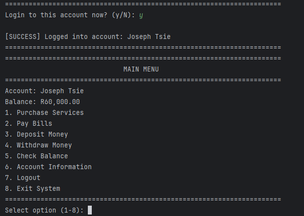

# Billing_System
A console-based billing management system in Python that allows users to manage accounts, perform transactions, and maintain persistent account data using file storage. Designed for learning purposes and small-scale simulations of banking or utility systems.

## Features

* **Account Management:** Create, view, and select user accounts.
* **Transactions:** Purchase services (Electricity, Data, Airtime, Water, Gaming). Pay bills (Netflix, Internet, Insurance, Gym, Rent). Deposit and withdraw funds.
* **Persistent Storage:** Accounts stored in JSON registry. Each account has a separate balance file. Transaction logs are saved for auditing.
* **User Interface:** Styled console menus, section headers, transaction confirmations, and token generation for purchases.
* **Error Handling:** Handles invalid input, negative balances, and corrupted files safely.

## Installation

1. Clone the repository:

   ```
   git clone https://github.com/jotm-stack/billing-system.git
   cd billing-system
   ```
2. Ensure Python 3.7+ is installed.
3. Run the program:

   ```
   python Biller.py
   ```

## Usage

```python
from Biller import BillingSystem

system = BillingSystem()
system.start()
```


* Create or select an account.


* Deposit, withdraw, or purchase services.


* Transaction history is logged for auditing.

* Balances are saved automatically after every transaction.


## Key Classes

* **BillingSystem:** Main system logic, menus, and user interactions.
* **AccountManager:** Manage account registry and creation.
* **BankAccount:** Represent individual accounts with deposit/withdraw functionality.
* **BillingStyle:** Styled console output for headers, menus, and transactions.
* **FileManager:** Handles file storage for balances and registry.
* **TransactionLogger:** Logs transactions with timestamps and tokens.
* **Utility Functions:** `generate_token()`, `format_currency()`, `validate_account_name()`, `validate_amount()`.

## Dependencies

* Python 3.7+
* Standard Python libraries: `os`, `json`, `datetime`, `random`, `sys`

## Notes

* Default initial balance: R1,000,000 if not specified.
* Accounts are stored persistently in `accounts_registry.json` and `accounts/account_<ID>_balance.txt`.
* Transactions generate a 16-digit reference token for tracking.
* Transaction history is stored in `logs/account_<ID>_transactions.log`.

---
